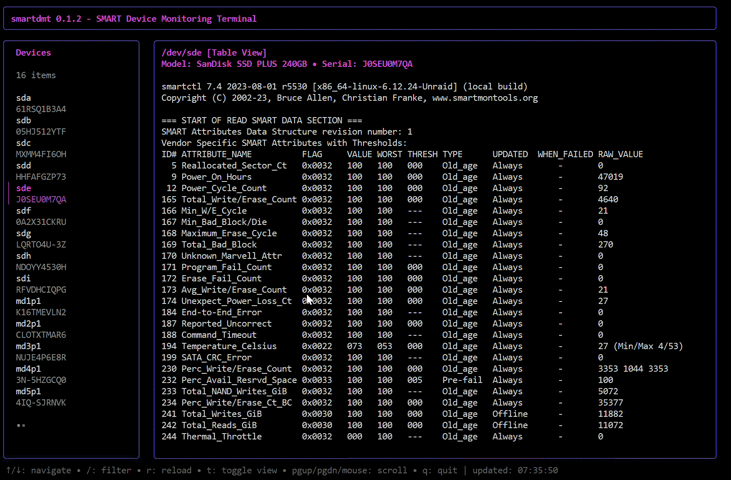

## smartdmt - SMART Device Monitoring Terminal

<a href="https://github.com/desertwitch/smartdmt/tags"></a>
<a href="https://go.dev/"></a>
<a href="https://pkg.go.dev/github.com/desertwitch/smartdmt"></a>
<a href="https://goreportcard.com/report/github.com/desertwitch/smartdmt"></a>
<a href="./LICENSE"></a>
<br>
<a href="https://github.com/desertwitch/smartdmt/actions/workflows/golangci-lint.yml"></a>
<a href="https://github.com/desertwitch/smartdmt/actions/workflows/golang-tests.yml"></a>
<a href="https://github.com/desertwitch/smartdmt/actions/workflows/golang-build.yml"></a>

<br>

`smartdmt` is a small utility that provides a simple terminal user interface
(TUI) for inspecting your connected block devices SMART information. It was
developed primarily as a companion application to
[ShredOS](https://github.com/PartialVolume/shredos.x86_64), so that such
information can be observed during disk wiping. However, the utility also
functions as a standalone program.

The TUI acts as a visual wrapper, calling `lsblk` and `smartctl` under the hood
to provide a side-by-side view of all block devices and their SMART information.
The data is automatically refreshed and basic filtering is possible.

### Installation

To build from source, a `Makefile` is included with the project's source code.
Running `make all` will compile the application and pull in any necessary
dependencies. `make check` runs the test suite and static analysis tools.

For convenience, precompiled static binaries for common architectures are
released through GitHub. These can be installed into `/usr/bin/` or respective
system locations; ensure they are executable by running `chmod +x` before use.

> All builds from source are designed to generate [reproducible builds](https://reproducible-builds.org/),
> meaning that they should compile as byte-identical to the respective released binaries and also have the
> exact same checksums upon integrity verification.

#### Building dependencies:
- Go version 1.24.2 or higher

#### Runtime dependencies:
- `lsblk` (as part of `util-linux` package)
- `smartctl` (as part of `smartmontools` package)

#### Building from source:
```
git clone https://github.com/desertwitch/smartdmt.git
cd smartdmt
make all
```

#### Running a built executable:

```
./smartdmt
```

## License

All code is licensed under the MIT License.
